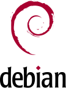

# Debian and DebConf

.fx: title_slide

Stefano Rivera <`stefanor@debian.org`>

Buenos Aires, 27 August 2025

---

# `whoami`

* Stefano Rivera: Software engineer working for Freexian
* Debian User since ~woody (2003)
* Debian Developer since 2011
* Attending DebConf since DebConf 11
* DebConf Video Team core
* DebConf Local Team for DebConf 16
* Sit on DebConf Committee with Antonio Terceiro, Bernelle Verster,
  Gunnar Wolf, **Nattie Mayer-Hutchings**, and Sruthi Chandran

---

# Debian

* Free Software Linux Distribution, since 1993
* Brings together 70 000 free software packages into a coherent system
* More importantly, it's a community
    * The distribution is entirely community run
    * With some help from employees of companies that depend on it
* Around 1000 developers from 56 countries
* \> 1370 Unique contributors in the last year

---

# History of DebConf

* DebConf has been running since 2000
* Making this the 27th DebConf
* We were in Argentina in 2008 (before my time)
* Nearby in Curitiba in 2019

---

# Goals of DebConf

* Face time for Debian community members
* Discuss problems across teams
* Share presentations on work
* Outreach to new communities

---

# Not a typical conference

* Grass roots, typically in universities
* Entirely volunteer run
* Free attendance (and bursaries)
* A lot of international attendees
* We use commercial caterers, sometimes hotels, etc.

---

# Two events in one

* 1 week of DebCamp
    * Unscheduled sprints and discussions
    * Set up DebConf infrastructure
* 1 week of DebConf
    * 3 videoed talk rooms
    * 1 day off for Day Trips

---

# DebCamp

* A week devoted to working on Debian
* Some groups sprint on projects together
* Individuals work on their own projects
* Starts small, attendance grows during the week
* We get to slowly build up to the main conference
* Video Team sets up A/V equipment in rooms

---

# Daily arrivals

---

# DebConf

* A more typical conference
* Live Streams and recordings
* Academic-style presentations
* BoF sessions (team meetings)
* Local language sessions for outreach
* Hacklabs (working areas)
* Some special activities (Day Trip day, conference dinner, etc.)

---

# Budget

* Typically around 200k USD
    * Raised 290k USD sponsorship in France
    * Raised 190k USD sponsorship in South Korea
* Majority goes towards travel bursaries
* Also significant number of accommodation and food bursaries
* Some income from fully self-paid attendees
    * Total France income was 440k USD
    * South Korea had 230k USD

---

# Raising sponsorship

* We have some regular international sponsors
* Local sponsors require local connections
* If you know an organization that could sponsor, get in touch with us

---

<table>
    <thead>
        <tr>
            <th></th>
            <th>Supporter</th>
            <th>Bronze</th>
            <th>Silver</th>
            <th>Gold</th>
            <th>Platinum</th>
        </tr>
    </thead>
    <tbody>
        <tr>
            <td>Contribution in USD</td>
            <td>&lt; 3,000</td>
            <td>3,000</td>
            <td>7,500</td>
            <td>15,000</td>
            <td>30,000</td>
        </tr>
        <tr>
            <td>Logo on sponsor webpage</td>
            <td>✓</td>
            <td>✓</td>
            <td>✓</td>
            <td>✓</td>
            <td>✓</td>
        </tr>
        <tr>
            <td>Provide materials for conference bags</td>
            <td></td>
            <td>✓</td>
            <td>✓</td>
            <td>✓</td>
            <td>✓</td>
        </tr>
        <tr>
            <td>Logo on T-shirts and conference bags</td>
            <td></td>
            <td></td>
            <td>✓</td>
            <td>✓</td>
            <td>✓</td>
        </tr>
        <tr>
            <td>Presence at the job fair</td>
            <td></td>
            <td></td>
            <td>✓</td>
            <td>✓</td>
            <td>✓</td>
        </tr>
        <tr>
            <td>Logo on video streams and recordings</td>
            <td></td>
            <td></td>
            <td></td>
            <td>✓</td>
            <td>✓</td>
        </tr>
        <tr>
            <td>Logo on general conference banners</td>
            <td></td>
            <td></td>
            <td></td>
            <td>✓</td>
            <td>✓</td>
        </tr>
        <tr>
            <td>Logo on podium banners</td>
            <td></td>
            <td></td>
            <td></td>
            <td></td>
            <td>✓</td>
        </tr>
        <tr>
            <td>Mention in press releases</td>
            <td></td>
            <td></td>
            <td></td>
            <td></td>
            <td>✓</td>
        </tr>
    </tbody>
</table>

There is a 40% discount for Argentine sponsors

---

# How to help

* Help to raise sponsorship
    * Contact engineers and management in companies you know
* Help make the event happen:
    * Join the local Team's Telegram
    * You don't have to be in Santa Fe (or Argentina)
* Volunteer on site:
    * Attend the conference
    * Sign up for the volunteer system and take some tasks

---

# Existing community teams

* Bursary
* Video
* Content (needs assistance)
* Sponsorship (needs assistance)
* Front Desk (needs assistance)
* Publicity (needs assistance)
* Website (needs assistance)
* Cheese & Wine Party

---

# Organizing a DebConf

* Accommodation
* Food
* Conference Space
* Internet Access

---

# Accommodation

* Typically shared university dormitories
* Hotels when we have to
* As close to the event as possible
* Need some accessible rooms
* Almost all attendees need accommodation
    * Only bursary attendees are critical

---

# Food

* Basic filling meals
* Many vegan attendees
* A few complex dietary requests (not critical)
* Clear labels including allergens

